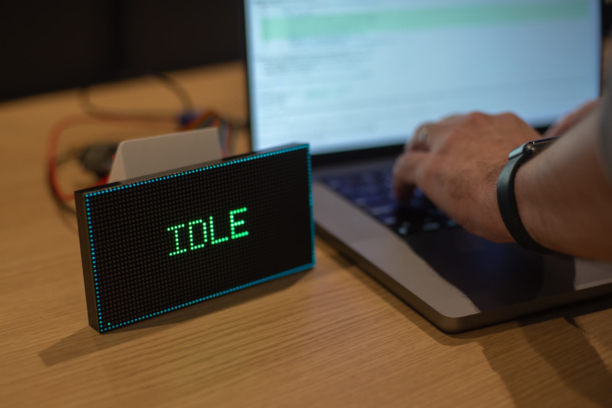
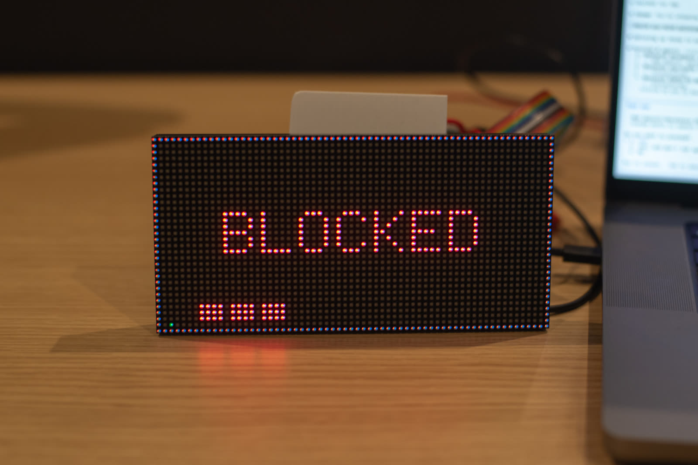

# ClaudePanel

**Claude Code External Status Display**

ClaudePanel is a small hardware indicator that shows what your coding
agent is doing right now — whether it's processing your prompt, waiting
on you to approve a tool, finished its turn, or stuck on something — so
you can glance at a panel on your desk instead of watching your
terminal. It's built for Claude Code, and works with any agent that
implements Claude Code's plugin architecture — GitHub Copilot CLI is
the tested example.


<p style="text-align: center; font-size: 0.85rem; color: #6a737d; margin-top: 0.5rem;"><em>Turn finished — the panel goes green while you're the bottleneck.</em></p>

<style>
  /* ---- feature cards (the three "panelly" buttons) ---- */
  .feature-cards {
    display: grid;
    grid-template-columns: repeat(3, 1fr);
    gap: 1.25rem;
    margin: 2.5rem 0 3rem;
  }
  @media (max-width: 600px) {
    .feature-cards { grid-template-columns: 1fr; }
  }
  .feature-card {
    position: relative;
    display: flex;
    flex-direction: column;
    justify-content: flex-end;
    min-height: 200px;
    padding: 1.5rem 1.25rem;
    border-radius: 10px;
    overflow: hidden;
    text-decoration: none !important;
    color: #fff !important;
    background-color: #1f2933;
    background-size: cover;
    background-position: center;
    transition: transform 0.18s ease, box-shadow 0.18s ease;
    text-align: left;
    box-shadow: 0 2px 6px rgba(0, 0, 0, 0.12);
  }
  /* dark + green gradient overlay so text stays readable
     regardless of which photo loremflickr happens to hand back */
  .feature-card::before {
    content: '';
    position: absolute;
    inset: 0;
    background: linear-gradient(
      135deg,
      rgba(15, 32, 28, 0.78) 0%,
      rgba(21, 153, 87, 0.55) 100%
    );
    transition: opacity 0.18s ease;
    z-index: 1;
  }
  .feature-card > * { position: relative; z-index: 2; }
  .feature-card:hover {
    transform: translateY(-3px);
    box-shadow: 0 6px 18px rgba(21, 153, 87, 0.28);
  }
  .feature-card:hover::before { opacity: 0.85; }
  .feature-card .feature-card-title {
    display: block;
    margin: 0 0 0.45rem;
    font-size: 1.35em;
    font-weight: 600;
    color: #fff;
    text-shadow: 0 1px 2px rgba(0, 0, 0, 0.4);
  }
  .feature-card .feature-card-sub {
    display: block;
    color: rgba(255, 255, 255, 0.92);
    font-size: 0.95em;
    line-height: 1.45;
    text-shadow: 0 1px 2px rgba(0, 0, 0, 0.35);
  }

  /* ---- section dividers ---- */
  .section-divider {
    border: 0;
    height: 3px;
    background: linear-gradient(
      90deg,
      transparent 0%,
      #159957 50%,
      transparent 100%
    );
    margin: 4rem auto 3rem;
    max-width: 60%;
    border-radius: 2px;
  }
</style>

<div class="feature-cards">
  <a class="feature-card" href="#the-panel"
     style="background-image: url('https://loremflickr.com/600/300/led,matrix,pixel');">
    <span class="feature-card-title">The Panel</span>
    <span class="feature-card-sub">What you see, and what each state means.</span>
  </a>
  <a class="feature-card" href="#installation"
     style="background-image: url('https://loremflickr.com/600/300/circuit,electronics,solder');">
    <span class="feature-card-title">Installation</span>
    <span class="feature-card-sub">Firmware → bridge → plugin, in that order.</span>
  </a>
  <a class="feature-card" href="#how-it-works"
     style="background-image: url('https://loremflickr.com/600/300/network,data,signal');">
    <span class="feature-card-title">How it works</span>
    <span class="feature-card-sub">From prompt to pixels in three hops.</span>
  </a>
</div>

<hr class="section-divider">

## The Panel

The panel renders one of six states at any given time, picked to be
distinguishable at a glance from across a desk:

| State          | Meaning                                           |
|----------------|---------------------------------------------------|
| **idle**       | Claude has finished its turn; waiting for you.    |
| **working**    | Claude is actively processing your prompt.        |
| **thinking**   | Claude is in the middle of a response but hasn't  |
|                | called a tool for a while — usually composing.    |
| **blocked**    | Claude needs your input (permission prompt, etc.) |
| **compacting** | Claude Code is summarizing the conversation       |
|                | history — usually a 10–60s pause.                 |
| **error**      | A tool call returned an error.                    |


<p style="text-align: center; font-size: 0.85rem; color: #6a737d; margin-top: 0.5rem;"><em>blocked — the agent wants a permission decision and you're across the room.</em></p>

Alongside the state, the panel also shows running counts of subagents
and active tasks — handy when you've kicked off parallel work and want
to monitor it without scrolling the terminal. (You can see the counter
dots along the bottom edge of the photo above.)

A single firmware instance can drive one panel or a chain of up to
four 64×32 panels, with each panel optionally split into two
half-panel "client slots" so multiple Claude Code sessions can share a
display.

<hr class="section-divider">

## How it works

When you write a prompt in your agent, ClaudePanel converts that
keystroke into pixels in three hops:

1. **The plugin** *(this repo)* hooks every agent lifecycle event
   — `UserPromptSubmit`, `Stop`, `PreToolUse`, `PostCompact`, and so on
   — and publishes a small JSON event for each one to a local TCP
   broker on your machine.
2. **The bridge** subscribes to the broker, runs a state machine over
   the event stream (idle / working / thinking / blocked / compacting
   / error), and forwards each state change as a one-line JSON message
   over USB serial.
3. **The firmware** on the ESP32-S3 reads the serial line, picks the
   right palette and glyph, and updates the HUB75 panel's framebuffer.

The whole loop is fast enough that the panel reacts within a few
hundred milliseconds of you pressing Enter.

```
 Claude Code  ──►  Plugin  ──►  Bridge  ──►  Firmware  ──►  Display
                  (Python)    (cross-     (ESP32-S3)     (RGB matrix
                              platform)                   panel)
```

Each piece lives in its own repo and is the source of truth for its
own internals. See [Repos](#repos) at the bottom.

<hr class="section-divider">

## Installation

ClaudePanel has three pieces and they need to come up in a specific
order: **firmware first**, then **bridge**, then **plugin**. Each
piece has detailed docs of its own — this page is the orientation
that ties them together.

### 1. Flash the firmware

Build and flash the ESP32-S3 firmware to your panel hardware. You'll
need ESP-IDF v6.0 installed locally and a HUB75 panel wired up
(default expectation is a 64×32 WaveShare RGB-Matrix-P2.5; multi-
panel chains are supported).

→ **[the firmware repo on GitHub]({{ site.firmware_site }})**

Once flashed, plug the ESP32-S3 into your computer over USB. It
enumerates as a serial device — `COM5` on Windows, `/dev/cu.usbmodem*`
on macOS, `/dev/ttyACM0` on Linux — and the panel boots into an
"unknown" state, ready to receive events.

### 2. Install + configure the bridge

The bridge is a system-tray app (Windows notification area / macOS
menu bar / Linux status icon) that subscribes to the plugin's local
broker and forwards each Claude Code event to the firmware over USB
serial. Cross-platform installers ship on every release.

→ **[the bridge install page]({{ site.bridge_site }})**

That page auto-detects your OS and shows the right download
(`Setup.exe` on Windows, `.dmg` on macOS, `.AppImage` on Linux). It
also covers the OS-specific quirks (SmartScreen on Windows,
Gatekeeper on macOS, tray-host extensions on GNOME). After install,
right-click the tray icon → **Connect device** to point the bridge
at the ClaudePanel you connected in step 1.

### 3. Install the plugin

The plugin (this repo) is the Claude Code half of the system: it
hooks every lifecycle event and publishes the state stream the
bridge subscribes to.

**Prerequisite:** Python 3 installed. The plugin's hook and slash
commands invoke scripts via `python3 ... || python ...` — the polyglot
that picks the right interpreter on every platform:

  - **macOS / Linux / WSL:** the `python3` branch wins (Homebrew,
    pyenv, system package manager — anything that puts `python3`
    on `PATH`).
  - **Windows:** `python3` doesn't exist on a typical Windows Python
    install, so the `||` falls through to `python`, which is Py3 from
    the python.org or Microsoft Store installer. It must be a **real
    Python install** — the `python`/`python3` App Execution Alias
    stubs that open the Microsoft Store don't count.

#### Which agents can drive the panel?

The plugin is built as a Claude Code plugin, and any agent that
implements Claude Code's plugin architecture can run it:

| Host                                   | Panel states | Slash commands | Slot pairing | Status |
|----------------------------------------|--------------|----------------|--------------|--------|
| **Claude Code** (CLI)                  | ✅           | ✅ `/llmstatus:*` | ✅ commands or env | **Tested** |
| **Copilot CLI** (≥ 1.0.66)             | ✅           | ✅ (as skills)    | ✅ commands or env | **Tested** |
| **Claude Code in VS Code / JetBrains** | ✅           | ✅                | ✅           | Expected — same engine as the CLI, shares its install |
| **VS Code Copilot** (agent mode)       | ✅ expected  | ⚠️ may not surface in chat | env var | Expected — untested; native-Windows caveat below |
| **JetBrains Copilot**                  | ⏳           | ⏳                | ⏳           | Untested — moving to the Copilot CLI harness, which we support |
| **Copilot cloud agent** (github.com)   | —            | —                | —            | n/a — runs in GitHub's cloud, no path to the USB panel on your desk |

Pick your host for the specifics:

<style>
  .host-tabs > input { display: none; }
  .host-tab-labels {
    display: flex; flex-wrap: wrap; gap: 0.4rem;
    margin: 1rem 0 0; padding: 0;
  }
  .host-tab-labels label {
    padding: 0.35rem 0.9rem; cursor: pointer;
    border: 1px solid #d0d7de; border-radius: 6px 6px 0 0;
    border-bottom: none; background: #f6f8fa;
    font-weight: 600; font-size: 0.9rem; color: #57606a;
  }
  .host-tab-panel {
    display: none; border: 1px solid #d0d7de; border-radius: 0 6px 6px 6px;
    padding: 0.25rem 1.25rem; margin-bottom: 1.5rem;
  }
  #tab-claude:checked    ~ .host-tab-labels label[for="tab-claude"],
  #tab-copilot:checked   ~ .host-tab-labels label[for="tab-copilot"],
  #tab-vscode:checked    ~ .host-tab-labels label[for="tab-vscode"],
  #tab-jetbrains:checked ~ .host-tab-labels label[for="tab-jetbrains"] {
    background: #fff; color: #159957; border-color: #159957;
    border-bottom: 1px solid #fff; margin-bottom: -1px; position: relative; z-index: 1;
  }
  #tab-claude:checked    ~ #panel-claude,
  #tab-copilot:checked   ~ #panel-copilot,
  #tab-vscode:checked    ~ #panel-vscode,
  #tab-jetbrains:checked ~ #panel-jetbrains { display: block; }
</style>

<div class="host-tabs">
  <input type="radio" id="tab-claude" name="host-tab" checked>
  <input type="radio" id="tab-copilot" name="host-tab">
  <input type="radio" id="tab-vscode" name="host-tab">
  <input type="radio" id="tab-jetbrains" name="host-tab">
  <div class="host-tab-labels">
    <label for="tab-claude">Claude Code</label>
    <label for="tab-copilot">Copilot CLI</label>
    <label for="tab-vscode">VS Code Copilot</label>
    <label for="tab-jetbrains">JetBrains Copilot</label>
  </div>

  <div class="host-tab-panel" id="panel-claude" markdown="1">

Install from inside Claude Code:

```
/plugin marketplace add sep/cc-status-plugin
/plugin install llmstatus@llmstatus-market
```

Then run the one-time permission setup so Claude Code stops asking to
approve every plugin-driven Bash invocation:

```
/llmstatus:permit
```

If you have a multi-panel chain (rather than a single 64×32), tell the
firmware once — the layout is cached in NVS so it survives reboots:

```
/llmstatus:configure 2
```

`/llmstatus:help` lists every slash command the plugin provides.

**IDE extensions:** the Claude Code extensions for VS Code and
JetBrains run the same engine and share the CLI's `~/.claude` install —
nothing extra to do. Sessions opened in the IDE drive the panel exactly
like terminal sessions.

  </div>

  <div class="host-tab-panel" id="panel-copilot" markdown="1">

The same plugin installs into `copilot` (≥ 1.0.66), whose plugin
protocol is Claude-compatible. Same marketplace, same commands, from
inside a Copilot session:

```
/plugin marketplace add sep/cc-status-plugin
/plugin install llmstatus@llmstatus-market
/llmstatus:permit
```

Copilot sessions then drive the panel exactly like Claude sessions and
can share slots with them. Copilot-flavored notes:

- `/llmstatus:permit` writes Copilot's `permissions-config.json`
  (command approvals + path-prompt allowlisting for the status dir),
  scoped **per repo/directory** — re-run it once in each repo where
  you use the panel.
- `CLAUDE_STATUS_SLOT=1 copilot` binds the session to slot 1 at
  launch, no slash command needed.
- On Windows, make sure `python` is a real install, not the Microsoft
  Store alias stub.

  </div>

  <div class="host-tab-panel" id="panel-vscode" markdown="1">

*(Using the **Claude Code** extension instead? See the Claude Code tab
— it shares the CLI install.)*

VS Code's agent-plugin system auto-detects Claude-format plugins and
runs their hooks, so Copilot agent mode can drive the panel. The
smoothest path is to **install via Copilot CLI first** (see that tab) —
VS Code auto-discovers plugins from `~/.copilot/installed-plugins/`.
Alternatively, use **Chat: Install Plugin From Source** from the
command palette.

Caveats (this host is documented-but-untested — reports welcome):

- Plugin slash commands may not surface in VS Code chat. Pair the
  session to a slot with the env var instead: launch VS Code from a
  shell with `CLAUDE_STATUS_SLOT=1` set, or bind from a CLI session.
- Native Windows is unverified; if the panel stays dark, launch with
  `CLAUDE_STATUS_DEBUG=1` in the environment and check
  `~/.claude-status/debug.log` for what (if anything) the hooks
  received.

  </div>

  <div class="host-tab-panel" id="panel-jetbrains" markdown="1">

*(Using the **Claude Code** plugin instead? See the Claude Code tab —
it shares the CLI install.)*

Untested, but converging on supported: GitHub is moving JetBrains
Copilot to **Copilot CLI as its agent harness**. On builds using the
CLI harness, the Copilot CLI install (see that tab) applies as-is —
sessions run through the same CLI the plugin already supports.

On older builds with JetBrains' native hooks, only a subset of
lifecycle events fires (notably no `Stop`), so the panel may not
return to *idle* between turns. If you try it, we'd love a report
either way.

  </div>
</div>

### Verify

Send any prompt in Claude Code. The panel should light up — yellow
while Claude is working, green when it goes idle. Run
`/llmstatus:identify` to flash each physical panel's slot ID
large and centered, so you can confirm wiring matches what the
firmware thinks the layout is.

If nothing happens, the bridge's tray icon's **Show logs** menu
item is the first place to look.

<hr class="section-divider">

## Commands

The panel has numbered **slots** (`1`, `2`, ...) and optional half-slots
(`1a`, `1b`, ...) that each render one Claude session's state. Slash
commands move sessions between slots; bridge subcommands manage the
bridge process itself. Most users only ever need the everyday tier.

### Plugin slash commands

Run these inside Claude Code (with the plugin installed).

#### Everyday

| Command                         | What it does                                            |
|---------------------------------|---------------------------------------------------------|
| `/llmstatus:show <slot>`    | Bind this session to slot N (e.g. `1`, `2b`). Displaces any prior occupant. |
| `/llmstatus:hide`           | Stop sending this session to the display.               |
| `/llmstatus:status`         | Show which sessions are bound to which slots.           |
| `/llmstatus:identify [N]`   | Flash each panel's slot ID for N seconds (default 5).   |

#### Setup

| Command                         | What it does                                            |
|---------------------------------|---------------------------------------------------------|
| `/llmstatus:configure <N>`  | Tell the firmware your panel-chain length (1–4).        |
| `/llmstatus:permit`         | One-time: allowlist the plugin's Bash invocations so    |
|                                 | commands stop prompting.                                |
| `/llmstatus:reset`          | Wipe all session slot bindings — clean slate.           |
| `/llmstatus:help`           | List every slash command, briefly.                      |

#### CLI pairing

If you routinely pair a fresh session to the same slot, set the
`CLAUDE_STATUS_SLOT` env var when invoking `claude` — the plugin's
SessionStart hook reads it and auto-binds the session to that slot
before you type anything:

```
CLAUDE_STATUS_SLOT=1 claude
```

Compose with shell aliases for different slots:

```bash
alias c1='CLAUDE_STATUS_SLOT=1 claude'
alias c2='CLAUDE_STATUS_SLOT=2 claude'
```

The same env var pairs Copilot CLI sessions — the plugin's
SessionStart hook doesn't care which agent invoked it:

```bash
alias gh1='CLAUDE_STATUS_SLOT=1 copilot'
```

### Bridge CLI

Run these in a terminal (or in pwsh on Windows). Most users won't need
to — the tray menu covers Connect device / Show logs / Pause / Quit.
The bridge install page documents each subcommand in detail.

→ **[bridge subcommand reference]({{ site.bridge_site }}#cli-usage)**

<hr class="section-divider">

## Repos

- Plugin (this site): [cc-status-plugin]({{ site.plugin_repo }})
- Bridge: [cc-status-bridge]({{ site.bridge_repo }})
- Firmware: [cc-status-display]({{ site.firmware_repo }})
